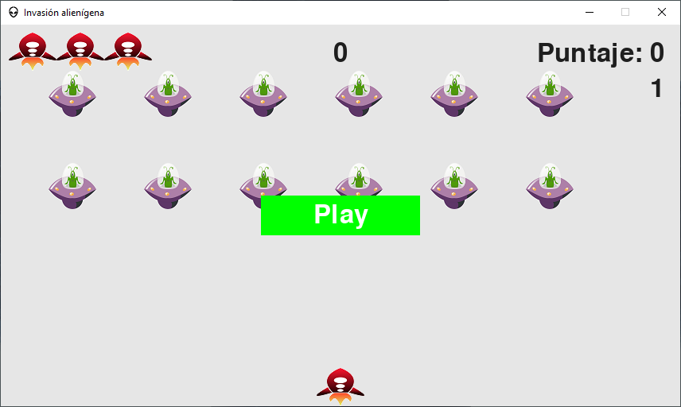
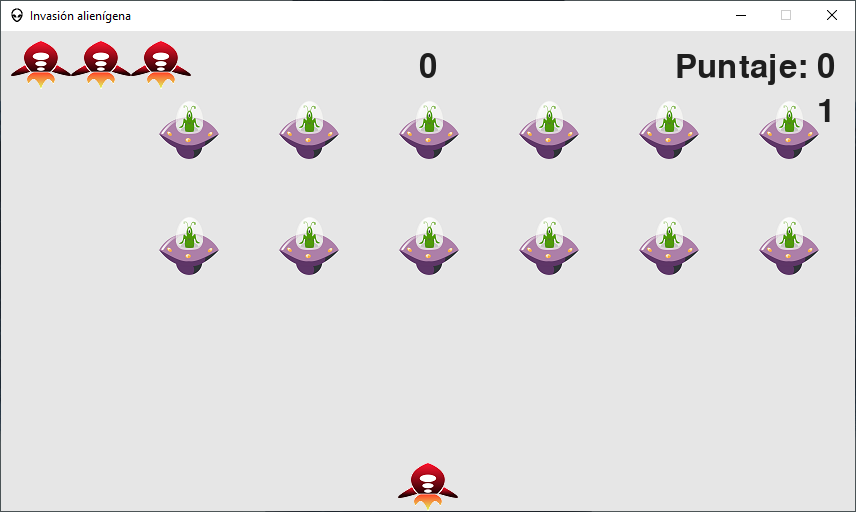
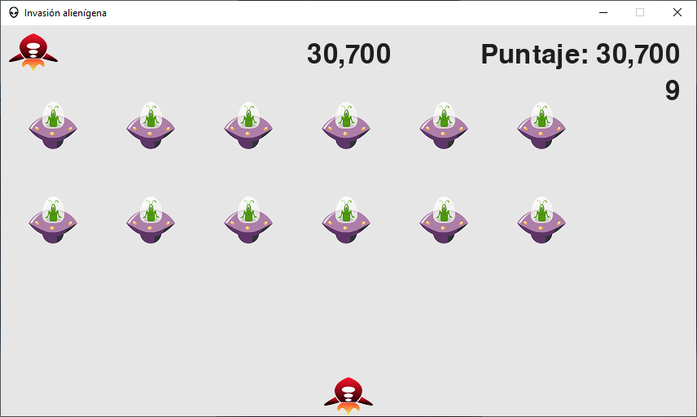

# Code Destroy the aliens

## Start developing

1.- Create a virtual environment

```python
python -m venv env
```

2.- Activate virtual environment

```bash
env\Scripts\Activate
```

3.- Install packages

```bash
pip install -r requirements.txt
```

4.- Compile Game on Windows

```bash
pyi-makespec main.py --name="Destroy Aliens" --icon="src\imagenes\icono.ico" --onefile --noconsole --add-data="src\configuracion;src\configuracion" --add-data="src\imagenes;src\imagenes" --add-data="src\musica;src\musica" --add-data="src\objetos;src\objetos" --add-data="src\utils.py;src" --version-file="version.txt"
```

```bash
pyinstaller '.\Destroy Aliens.spec'
```

## Game controls

- Left arrow
- Right arrow
- Up arrow
- Down arrow
- Space (shoot)
- Q (Exit game)

## libraries and modules used in the project

- Time
- Sys
- Pygame
- Pygame.sprite
- Pygame.font

## Early game designs

### Moment when opening the game



### Starting game level



### Remaining game lives and current score



## Creator and designer

- Ignacio Avilés
- Juan Galaz

## Social media

- [Github](http://github.com/avilesxd/)
- [Instagram](https://www.instagram.com/avilesxd/)
- [Facebook](https://www.facebook.com/ignacio.avilescardenasso)
- [Youtube](https://www.youtube.com/channel/UCYPsgamO7XeWOrXriOpJBqw)
- [TikTok](https://www.tiktok.com/@chle_igns)
