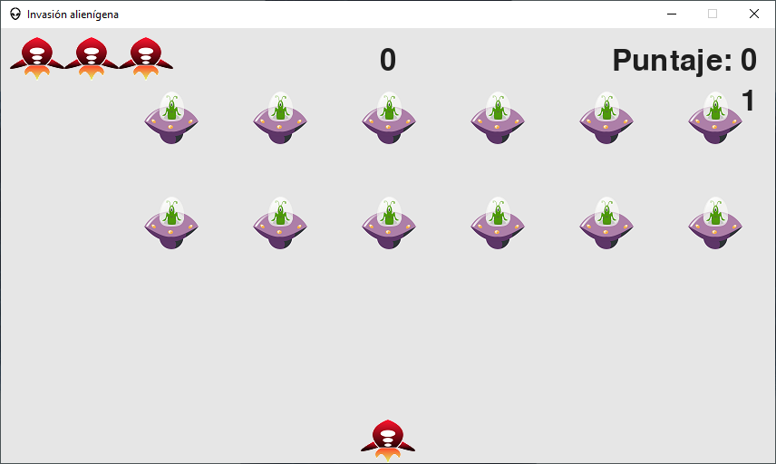
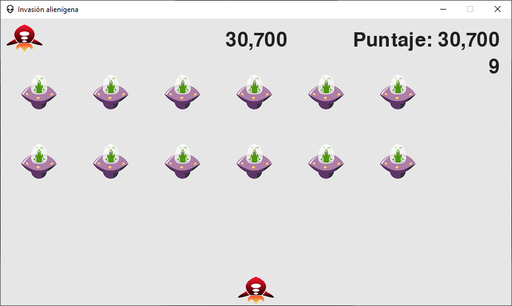

# Destroy the aliens

The library called pygame was used in this project for my first game made with python.

<a href="https://ignacioaviles.netlify.app/" target="_blank" rel="noreferrer"> 

# How to start?

In a console or terminal open the file named main.py

# Game controls

- Left arrow
- Right arrow
- Up arrow
- Arrow down
- Space (shoot)
- Q (Exit game)

# Photos

## The size of the alien rows and columns depends on the size of the window

 

### Moment when opening the game

 

### Starting game level

 

### Remaining game lives and current score

