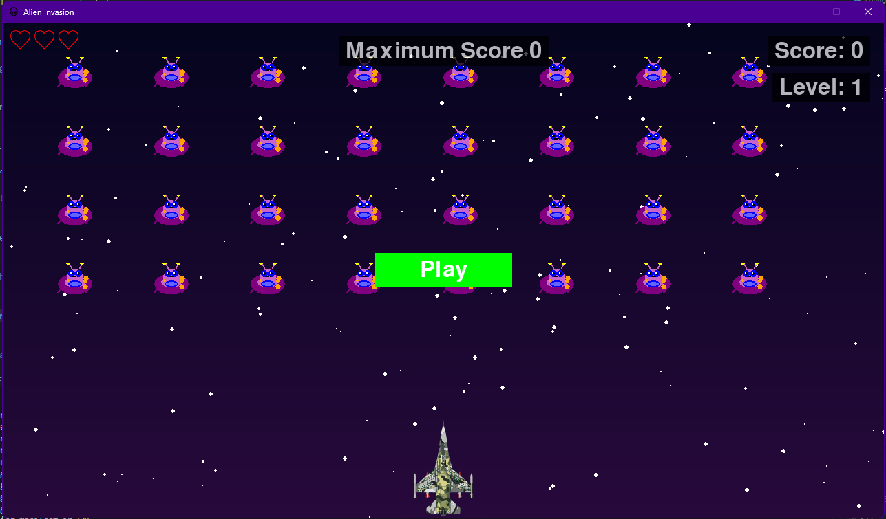

# 📚 Alien Invasion Documentation

    
    <table>
  <tbody>
    <tr>
      <td align="center" valign="top" width="14.28%"><a href="https://www.python.org/downloads/"> <b>Python</b></a></td>
      <td align="center" valign="top" width="14.28%"><a href="https://www.pygame.org/"> <b>Pygame</b></a></td>
      <td align="center" valign="top" width="14.28%"><a href="https://github.com/psf/black"> <b>Code Style</b></a></td>
    </tr>
  </tbody>
</table>

## 📖 Table of Contents

### 🚀 Getting Started

- [Quick Start](guides/getting-started/quick-start.md)
- [Installation](guides/getting-started/installation.md)
- [Configuration](guides/getting-started/configuration.md)

### 🎮 Game Guide

- [Gameplay Basics](guides/gameplay/basics.md)
- [Controls](guides/gameplay/controls.md)
- [Game Modes](guides/gameplay/modes.md)
- [Scoring System](guides/gameplay/scoring.md)
- [Power-ups](guides/gameplay/powerups.md)

### 🛠️ Development

- [Core Concepts](guides/development/core-concepts.md)
- [Game Architecture](guides/development/architecture.md)
- [Entity System](guides/development/entity-system.md)
- [Audio System](guides/development/audio-system.md)
- [Asset Management](guides/development/assets.md)

### 🧪 Testing & Quality

- [Testing Guide](guides/testing/README.md)
- [Code Quality](guides/development/code-quality.md)
- [Performance Optimization](guides/development/performance.md)

### 🤝 Contributing

- [Contributing Guide](guides/contributing/README.md)
- [Code of Conduct](guides/contributing/CODE_OF_CONDUCT.md)
- [Development Workflow](guides/contributing/workflow.md)

## 🔍 Quick Links

- [GitHub Repository](https://github.com/avilesxd/code-destroy-aliens)
- [Issue Tracker](https://github.com/avilesxd/code-destroy-aliens/issues)
- [Pull Requests](https://github.com/avilesxd/code-destroy-aliens/pulls)

## 📝 License

This project is licensed under the MIT License - see the [LICENSE](LICENSE.md)
file for details.
