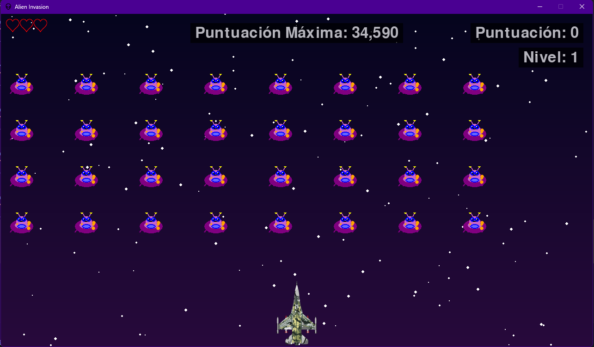
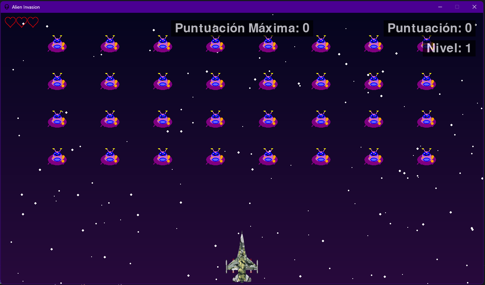

# 📚 Technical Documentation - Alien Invasions

Welcome to the technical documentation for **Alien Invasions**, an arcade shooter in which you must defend Earth from waves of aliens.

---

## 🎮 Game Images

| Start | Game | End |
|-------|-------|-----|
|  |  |  |

---

## 🧠 Project Architecture

The project is organized to clearly separate the different game components:

- `assets/` – Graphics resources, music, and icons.
- `config/` – Configuration files, music, and statistics.
- `core/` – Auxiliary logic and utility functions.
- `entities/` – Main game classes (ship, alien, bullets, buttons, scoreboard).
- `main.py` – Game entry point.

---

## 🧰 Requirements

- Python 3.8+
- pygame

---

## ⚙️ How to Run the Project

1. Clone the repository:

```bash
git clone https://github.com/usuario/code-destroy-aliens.git
cd code-destroy-aliens
```

2. Create a virtual environment:

```bash
python -m venv venv
source venv/bin/activate # On Windows: venv\Scripts\activate
```

3. Install the dependencies:

```bash
pip install -r requirements.txt
```

4. Run the game:

```bash
python main.py
```

---

## 🧱 Compile the game (Windows)

### 1. Create a custom `.spec` file

```bash
pyi-makespec main.py \
--name="Alien Invasion" \
--icon="src\icons\icon.ico" \
--onefile \
--noconsole \
--add-data="src\configuration;src\configuration" \
--add-data="src\images;src\images" \
--add-data="src\music;src\music" \
--add-data="src\objects;src\objects" \
--add-data="src\utils.py;." \
--version-file="version.txt"
```

### 2. Compile the game

```bash
pyinstaller ".\Alien Invasion.spec"
```

---

## 📝 Additional Notes

- This game was developed in Python with **pygame**.
- For further customization, check out the `src/config/configuration.py` file.

---

## 📄 License

This project is licensed under the [MIT License](../LICENSE)
