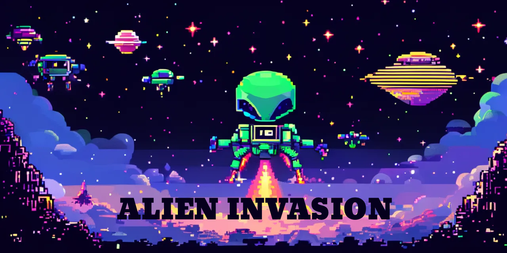

<div align="center">

<h3>Alien Invasion <em>A Modern Space Invaders</em></h3>



<p align="center">
  <a href="https://www.python.org/downloads/"></a>
  <a href="https://www.pygame.org/"></a>
  <a href="https://github.com/psf/black"></a>
  <a href="http://mypy-lang.org/"></a>
  <a href="https://pytest.org/"></a>
  <a href="LICENSE.md"></a>
</p>

Welcome to the official documentation for Alien Invasion. This classic
arcade-style game blends Space Invaders gameplay with modern engineering
practices: strict type safety, comprehensive testing, and a clean, modular
architecture.

</div>

---

## ✨ Features

- 🎯 **Classic Arcade Gameplay** - Fast-paced alien shooting action
- 🎨 **Modern Graphics** - Crisp sprites and smooth animations
- 🎵 **Dynamic Audio** - Immersive sound effects and background music
- 🏆 **High Score System** - Encrypted score persistence
- 🌍 **Multi-language Support** - Localized UI strings
- ⚙️ **Configurable Settings** - Customizable game parameters
- 🧪 **Type-Safe Codebase** - Full mypy strict mode compliance
- 📦 **Cross-Platform Builds** - Windows (.exe) and macOS (.dmg) support

---

## 📚 Documentation Overview

### 🚀 Getting Started

**New to Alien Invasion?** Start here to get up and running quickly.

- [Quick Start](guides/getting-started/quick-start.md) - Get the game running in
  5 minutes
- [Installation](guides/getting-started/installation.md) - Detailed setup
  instructions
- [Configuration](guides/getting-started/configuration.md) - Customize your game
  experience

### 🎮 Gameplay Guide

**Master the game mechanics** and improve your high score.

- [Gameplay Basics](guides/gameplay/basics.md) - Core mechanics and objectives
- [Controls](guides/gameplay/controls.md) - Keyboard shortcuts and commands
- [Game Modes](guides/gameplay/modes.md) - Different ways to play
- [Scoring System](guides/gameplay/scoring.md) - How points are calculated
- [Power-ups](guides/gameplay/powerups.md) - Special abilities and bonuses

### 🛠️ Developer Guide

**Build, extend, and customize** the game with confidence.

- [Core Concepts](guides/development/core-concepts.md) - Fundamental design
  patterns
- [Game Architecture](guides/development/architecture.md) - System design
  overview
- [Entity System](guides/development/entity-system.md) - Sprite-based entity
  management
- [Audio System](guides/development/audio-system.md) - Sound and music
  integration
- [Asset Management](guides/development/assets.md) - Loading and bundling
  resources
- [Code Quality](guides/development/code-quality.md) - Standards and best
  practices
- [Performance Optimization](guides/development/performance.md) - Profiling and
  tuning

### 🧪 Testing & Quality Assurance

**Ensure reliability** with comprehensive testing strategies.

- [Testing Guide](guides/testing/README.md) - Unit, integration, and headless
  testing
- [Type Safety](guides/development/core-concepts.md#type-safety) - mypy strict
  mode compliance
- [CI/CD Pipeline](guides/contributing/workflow.md#cicd) - Automated quality
  checks

### 🤝 Contributing

**Join the community** and help improve Alien Invasion!

- [Contributing Guide](guides/contributing/README.md) - How to contribute code
- [Code of Conduct](guides/contributing/CODE_OF_CONDUCT.md) - Community
  standards
- [Development Workflow](guides/contributing/workflow.md) - Branch strategy and
  PR process
- [Release Process](guides/contributing/release-process.md) - Version management

---

## 🎯 Quick Start

```bash
# Clone the repository
git clone https://github.com/avilesxd/code-destroy-aliens.git
cd code-destroy-aliens

# Install dependencies
npm install

# Run the game
npm run dev
```

**That's it!** The game will launch immediately. See the
[Quick Start Guide](guides/getting-started/quick-start.md) for more details.

---

## 🔗 Resources

- 📦 [GitHub Repository](https://github.com/avilesxd/code-destroy-aliens) -
  Source code and releases
- 🐛 [Issue Tracker](https://github.com/avilesxd/code-destroy-aliens/issues) -
  Report bugs or request features
- 🔀 [Pull Requests](https://github.com/avilesxd/code-destroy-aliens/pulls) -
  Contribute to the project
- 📖 [Documentation Site](https://avilesxd.github.io/code-destroy-aliens/) -
  Project docs and guides
- 💬
  [Discussions](https://github.com/avilesxd/code-destroy-aliens/discussions) -
  Ask questions and share ideas

---

## 🏗️ Built With

- **[Python 3.8+](https://www.python.org/)** - Core programming language
- **[Pygame 2.5.0+](https://www.pygame.org/)** - Game development framework
- **[pytest](https://pytest.org/)** - Testing framework
- **[mypy](http://mypy-lang.org/)** - Static type checker
- **[black](https://github.com/psf/black)** - Code formatter
- **[PyInstaller](https://pyinstaller.org/)** - Windows executable bundler
- **[py2app](https://py2app.readthedocs.io/)** - macOS application bundler

---

## 📄 License

This project is licensed under the **MIT License** - see the
[LICENSE](LICENSE.md) file for details.

---

<div align="center">

Made with ❤️ by the Alien Invasion Team

⭐ Star us on GitHub if you find this project helpful!

</div>
