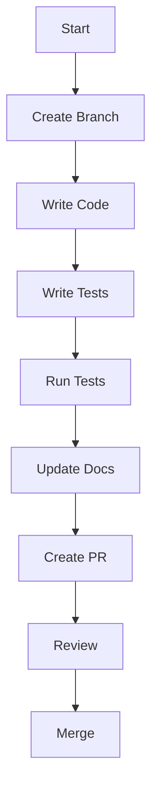

# 🔄 Development Workflow

## Overview

This guide details the development workflow for Alien Invasion, from setting up
your environment to submitting changes.

## Development Environment

### 1. Prerequisites

- Python 3.8+
- Node.js 16+
- Git
- Pygame 2.5.0+

### 2. Setup

```bash
# Clone repository
git clone https://github.com/avilesxd/code-destroy-aliens.git
cd code-destroy-aliens

# Install dependencies
npm install
pip install -r requirements.txt

# Set up pre-commit hooks
pre-commit install
```

## Git Workflow

### 1. Branch Naming

Use the following branch naming convention:

```
feature/feature-name
bugfix/bug-name
hotfix/issue-name
docs/documentation-name
```

### 2. Commit Messages

Follow the Conventional Commits specification:

```
feat: add new feature
fix: fix bug
docs: update documentation
style: format code
refactor: restructure code
test: add tests
chore: update dependencies
```

### 3. Pull Requests

1. Create a new branch
2. Make your changes
3. Run tests and checks
4. Create a PR with the template
5. Address review comments
6. Merge when approved

## Development Process

### 1. Feature Development



### 2. Bug Fixing

1. Reproduce the bug
2. Write a failing test
3. Fix the bug
4. Verify the test passes
5. Update documentation if needed

### 3. Documentation

1. Update relevant docs
2. Add examples
3. Verify with `mkdocs serve`
4. Include in PR

## Code Review Process

### 1. Review Checklist

- [ ] Code follows style guide
- [ ] Tests are included
- [ ] Documentation is updated
- [ ] No breaking changes
- [ ] Performance impact considered

### 2. Review Guidelines

- Be constructive
- Focus on code quality
- Consider edge cases
- Check for security issues

## Release Process

### 1. Versioning

Follow semantic versioning:

- MAJOR.MINOR.PATCH
- Increment based on changes

### 2. Release Steps

1. Update version numbers
2. Update changelog
3. Create release branch
4. Run full test suite
5. Create release tag
6. Deploy documentation

## Continuous Integration

### 1. Automated Checks

- Code formatting
- Linting
- Type checking
- Tests
- Documentation

### 2. Manual Checks

- Performance testing
- Gameplay testing
- Cross-platform testing

## Best Practices

### 1. Code Quality

- Write clean, maintainable code
- Follow SOLID principles
- Use design patterns appropriately
- Document complex logic

For more information about code quality standards, see the
[Code Quality Guide](../development/code-quality.md).

### 2. Testing

- Write tests for new features
- Maintain test coverage
- Test edge cases
- Performance test critical paths

### 3. Documentation

- Keep docs up to date
- Include examples
- Document breaking changes
- Update changelog

## Troubleshooting

### Common Issues

1. **Test Failures**
    - Check environment setup
    - Verify dependencies
    - Run tests locally

2. **Build Issues**
    - Check Python version
    - Verify Pygame installation
    - Check system dependencies

3. **Documentation Issues**
    - Verify MkDocs installation
    - Check markdown syntax
    - Test locally

## Next Steps

- Read the [Contributing Guide](README.md)
- Check out the [Testing Guide](../testing/README.md)
- Learn about [Code Quality](../development/code-quality.md)
