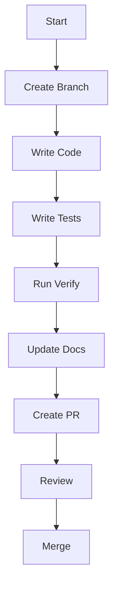

# 🔄 Development Workflow

## Overview

This guide describes the expected workflow for Alien Invasion contributions,
from setup to PR review.

## Development Environment

### Prerequisites

- Python 3.8+
- Node.js 18+
- Git
- Pygame 2.5.0+

### Setup

```bash
git clone https://github.com/avilesxd/code-destroy-aliens.git
cd code-destroy-aliens

# Install Node.js dependencies
npm install

# Create and populate the Python environment
python -m venv env
env\Scripts\activate  # Windows
source env/bin/activate  # Linux/macOS
npm run deps:install
```

## Git Workflow

### Branch Naming

Use these prefixes:

```
feature/feature-name
fix/bug-name
docs/documentation-name
refactor/refactor-name
test/test-name
chore/task-name
```

### Commit Messages

Use Conventional Commits with no scope:

```
feat: add new feature
fix: resolve collision bug
docs: update documentation
```

### Pull Requests

1. Create a branch
2. Make changes and add tests
3. Run `npm run verify`
4. Open a PR and address feedback

## Development Process



## Documentation Workflow

Serve docs locally with:

```bash
npm run docs:serve
```

## Continuous Integration

CI runs formatting, linting, type checks, tests, and documentation checks on
every PR. Fix failures locally before pushing updates.

## Best Practices

- Keep changes focused and well-scoped.
- Update tests and documentation with behavior changes.
- Avoid direct commits to `main`.

## Next Steps

- Read the [Contributing Guide](README.md)
- Check out the [Testing Guide](../testing/README.md)
- Learn about [Code Quality](../development/code-quality.md)
