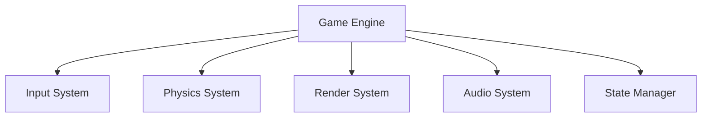
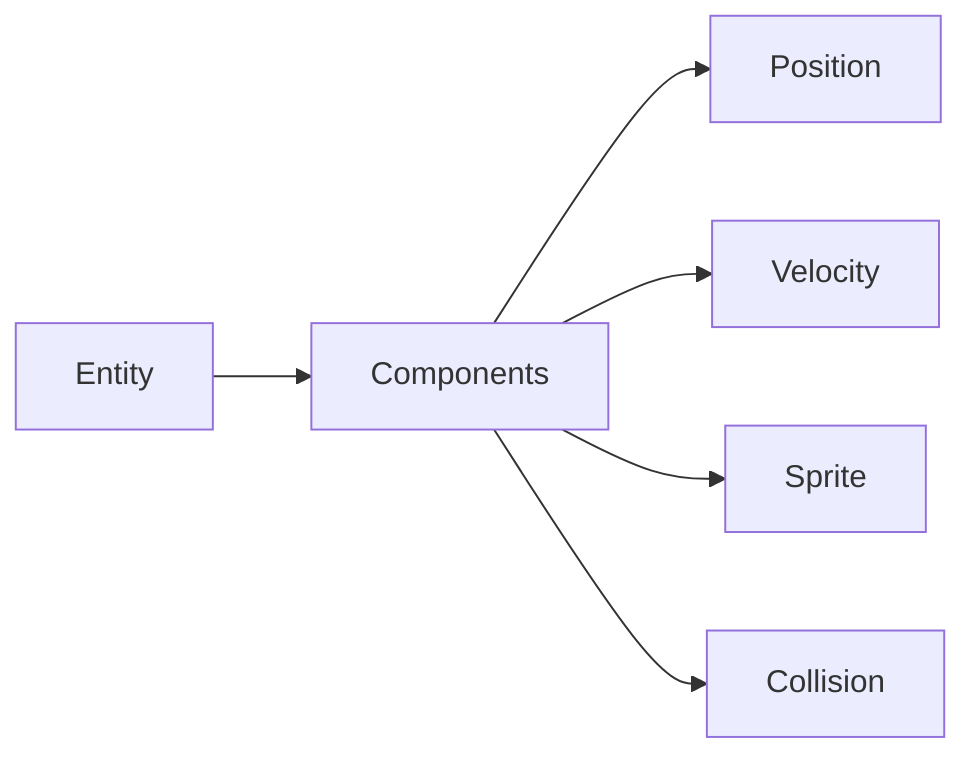

# 🏗️ Game Architecture

## Overview

Alien Invasion uses a modern, component-based architecture that emphasizes:

- **Modularity**: Easy to add/remove features
- **Scalability**: Can handle complex game logic
- **Maintainability**: Clear separation of concerns
- **Performance**: Optimized for real-time gameplay

## System Architecture

### 1. Core Systems



### 2. Entity Component System (ECS)



## Component Details

### 1. Core Components

```python
@dataclass
class Position:
    x: float
    y: float

@dataclass
class Velocity:
    x: float
    y: float

@dataclass
class Sprite:
    image: pygame.Surface
    rect: pygame.Rect
```

### 2. Game-Specific Components

```python
@dataclass
class Health:
    current: int
    max: int

@dataclass
class Weapon:
    damage: int
    cooldown: float
    last_shot: float
```

## System Implementation

### 1. System Base Class

```python
class System:
    def __init__(self):
        self.entities = []

    def add_entity(self, entity):
        self.entities.append(entity)

    def remove_entity(self, entity):
        self.entities.remove(entity)

    def update(self, dt):
        for entity in self.entities:
            self.process_entity(entity, dt)
```

### 2. System Registration

```python
class SystemManager:
    def __init__(self):
        self.systems = {}

    def register_system(self, system_type, system):
        self.systems[system_type] = system

    def update(self, dt):
        for system in self.systems.values():
            system.update(dt)
```

## State Management

### 1. State Interface

```python
class GameState:
    def enter(self):
        pass

    def exit(self):
        pass

    def update(self, dt):
        pass

    def render(self, screen):
        pass
```

### 2. State Transitions

```python
class StateMachine:
    def __init__(self):
        self.states = {}
        self.current = None

    def add_state(self, name, state):
        self.states[name] = state

    def change_state(self, name):
        if self.current:
            self.current.exit()
        self.current = self.states[name]
        self.current.enter()
```

## Resource Management

### 1. Asset Loading

```python
class AssetManager:
    def __init__(self):
        self.images = {}
        self.sounds = {}
        self.fonts = {}

    def load_image(self, name, path):
        self.images[name] = pygame.image.load(path)

    def get_image(self, name):
        return self.images[name]
```

### 2. Resource Caching

```python
class ResourceCache:
    def __init__(self):
        self.cache = {}

    def get(self, key, loader):
        if key not in self.cache:
            self.cache[key] = loader()
        return self.cache[key]
```

## Event System

### 1. Event Types

```python
class EventType(Enum):
    COLLISION = 1
    DEATH = 2
    POWERUP = 3
    SCORE = 4
```

### 2. Event Handling

```python
class EventManager:
    def __init__(self):
        self.listeners = defaultdict(list)

    def dispatch(self, event_type, data):
        for listener in self.listeners[event_type]:
            listener(data)
```

## Configuration System

### 1. Config Loading

```python
class Config:
    def __init__(self):
        self.settings = {}

    def load(self, path):
        with open(path) as f:
            self.settings = json.load(f)

    def get(self, key, default=None):
        return self.settings.get(key, default)
```

### 2. Game Settings

```python
class GameSettings:
    def __init__(self):
        self.window_size = (800, 600)
        self.fps = 60
        self.difficulty = "normal"
```

## Performance Considerations

### 1. Optimization Techniques

- Use sprite groups for efficient rendering
- Implement spatial partitioning for collisions
- Cache frequently used calculations
- Use object pooling for frequently created/destroyed objects

### 2. Memory Management

- Implement proper cleanup in state transitions
- Use weak references where appropriate
- Monitor memory usage in development

## Testing Architecture

### 1. Unit Testing

```python
def test_physics_system():
    system = PhysicsSystem()
    entity = create_test_entity()
    system.add_entity(entity)
    system.update(1.0)
    assert entity.position.x == 100
```

### 2. Integration Testing

```python
def test_game_loop():
    game = Game()
    game.initialize()
    game.update(1.0)
    assert game.state == GameState.PLAYING
```

## Next Steps

- Learn about [Entity System](entity-system.md)
- Explore [Audio System](audio-system.md)
- Read about [Testing](../testing/README.md)
