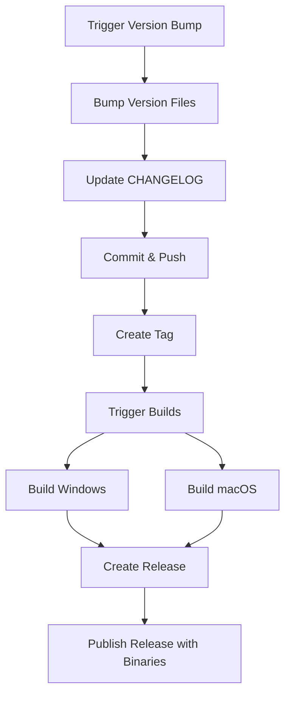

# Release Management

## Automated Release Process

This project uses a fully automated system to manage versions and releases.

## Option 1: GitHub Workflow (Recommended)

### From GitHub Interface

1. Go to **Actions** → **Version Bump and Release**
2. Click **Run workflow**
3. Select the version type:
    - `patch`: For fixes (1.2.0 → 1.2.1)
    - `minor`: For features (1.2.0 → 1.3.0)
    - `major`: For breaking changes (1.2.0 → 2.0.0)
4. Or enter a custom version (e.g., `1.5.0`)
5. Click **Run workflow**

### From Command Line

```bash
# Using GitHub CLI
gh workflow run version-bump.yml -f version_type=patch
gh workflow run version-bump.yml -f version_type=minor
gh workflow run version-bump.yml -f version_type=major

# With custom version
gh workflow run version-bump.yml -f custom_version=1.5.0
```

### What does the workflow do automatically?

1. ✅ Calculates the new semantic version
2. ✅ Updates `package.json`
3. ✅ Updates `tools/generate-version.py`
4. ✅ Generates version files (`versions/macos.txt` and `versions/windows.txt`)
5. ✅ Updates `CHANGELOG.md` with the new version
6. ✅ Creates a commit with the changes
7. ✅ Creates and pushes the tag (e.g., `v1.3.0`)
8. ✅ Triggers Windows and macOS builds automatically
9. ✅ Creates the GitHub release with binaries when builds complete

## Option 2: Local Script

If you prefer to work locally:

### Windows (PowerShell)

```powershell
# Bump patch version
.\scripts\bump-version.ps1 -Type patch

# Bump minor version
.\scripts\bump-version.ps1 -Type minor

# Bump major version
.\scripts\bump-version.ps1 -Type major
```

### Linux/macOS

```bash
# Grant execution permissions (first time only)
chmod +x scripts/bump-version.sh

# Bump patch version
npm run version:patch

# Bump minor version
npm run version:minor

# Bump major version
npm run version:major
```

### Steps After Local Script

The local script updates files but does NOT commit or push. You must:

1. Edit `CHANGELOG.md` with release notes
2. Review changes: `git status`
3. Commit: `git add . && git commit -m "chore: bump version to X.Y.Z"`
4. Tag: `git tag -a vX.Y.Z -m "Release vX.Y.Z"`
5. Push: `git push origin main --tags`

After pushing the tag, build workflows trigger automatically.

## Semantic Versioning

We follow [Semantic Versioning](https://semver.org/):

- **MAJOR** (X.0.0): Incompatible API changes
- **MINOR** (x.Y.0): New backward-compatible functionality
- **PATCH** (x.y.Z): Backward-compatible bug fixes

### Examples

- New alien type → `minor`
- Collision bug fix → `patch`
- Complete scoring system overhaul → `major`

## Changelog

Always update `CHANGELOG.md` with:

- **Added**: New features
- **Changed**: Changes to existing functionality
- **Fixed**: Bug fixes
- **Refactored**: Code refactoring
- **Chore**: Maintenance tasks

Example:

```markdown
## [v1.3.0] - 2025-12-11

### Added

- New boss alien with special abilities
- Power-up system for the ship

### Fixed

- Improved collision detection accuracy
- Fixed memory leak in bullet spawning
```

## Complete Release Flow



## Troubleshooting

### Workflow fails on "Create Release"

- Verify that both builds (Windows and macOS) completed successfully
- Check that artifacts were uploaded correctly
- Ensure the tag exists in the repository

### Build fails after version bump

- Verify that `requirements.txt` is up to date
- Ensure the PyInstaller spec file is valid
- Review workflow logs in GitHub Actions

### Local script doesn't work on Windows

- Make sure to run in PowerShell (not CMD)
- Verify that Node.js is installed
- Run: `Set-ExecutionPolicy -Scope Process -ExecutionPolicy Bypass`

## Reverting a Version

If you need to revert a version bump:

```bash
# Revert the commit
git revert HEAD

# Delete tag locally
git tag -d v1.3.0

# Delete tag remotely
git push origin :refs/tags/v1.3.0

# Delete the GitHub release
gh release delete v1.3.0
```

## Best Practices

1. 🎯 **Always test first**: Run `npm run verify` before making a release
2. 📝 **Document well**: Update CHANGELOG with clear details
3. 🏷️ **Use annotated tags**: Always with `-a` to include metadata
4. 🔄 **Review builds**: Ensure both builds complete before release
5. 🚀 **Release frequently**: Small, frequent releases are better than large,
   spaced-out ones

## Resources

- [Semantic Versioning](https://semver.org/)
- [Conventional Commits](https://www.conventionalcommits.org/)
- [Keep a Changelog](https://keepachangelog.com/)
- [GitHub CLI](https://cli.github.com/)
